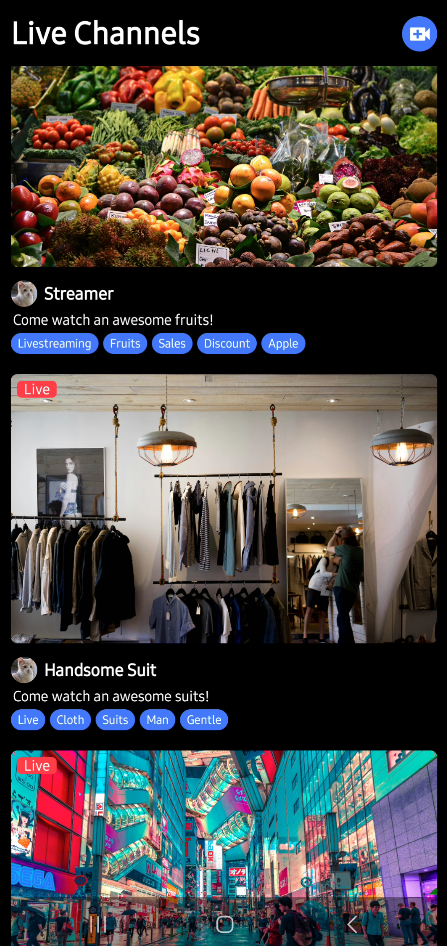
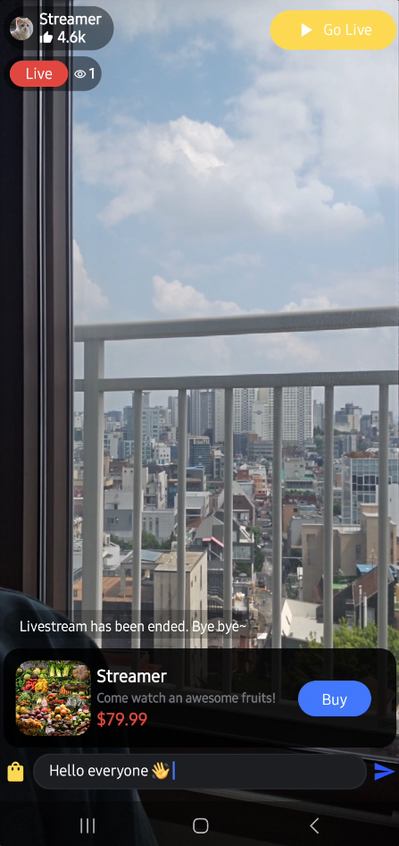
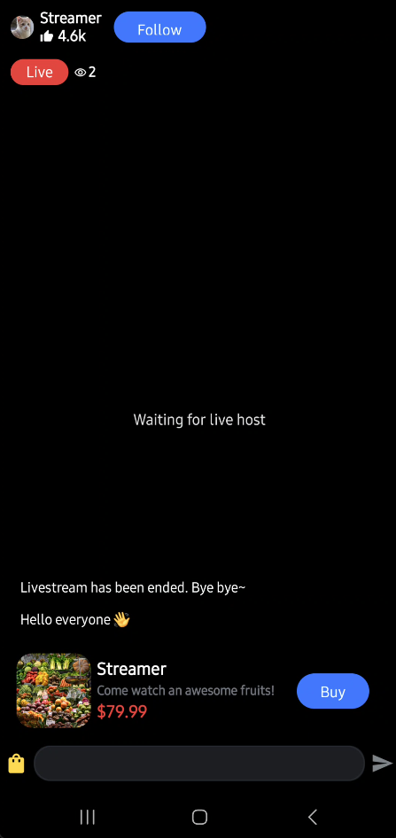
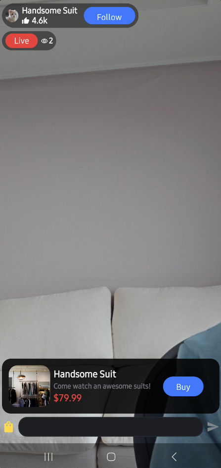
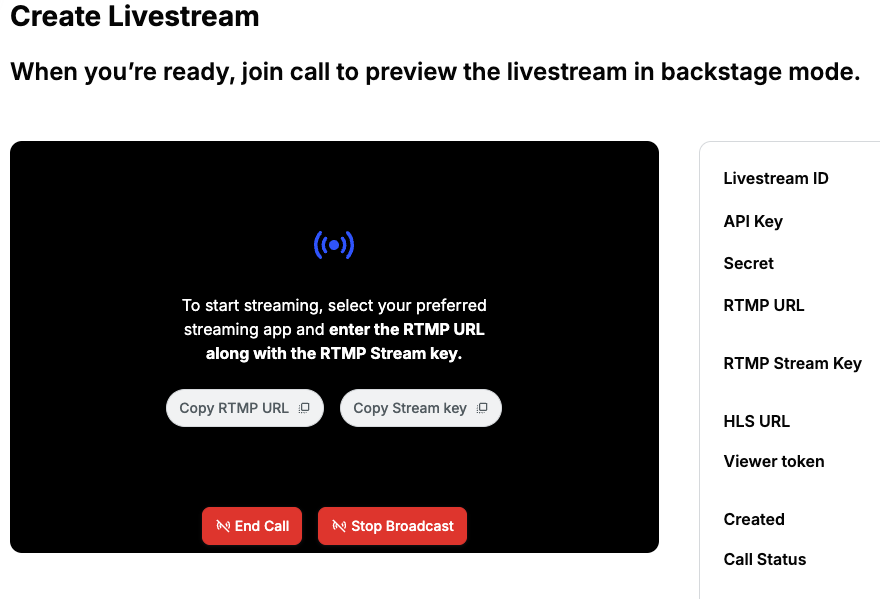

<h1 align="center">LiveShopping Android</h1>

<p align="center">
  <a href="https://opensource.org/licenses/Apache-2.0"></a>
  <a href="https://android-arsenal.com/api?level=21"></a>
  <a href="https://github.com/GetStream/liveshopping-android/actions/workflows/android.yml"></a>
  <a href="https://getstream.io?utm_source=Github&utm_medium=Jaewoong_OSS&utm_content=Developer&utm_campaign=Github_Aug2024_Jaewoong_LiveShopping&utm_term=DevRelOss"></a>
</p>

This is a real-time livestreaming demo app built with Jetpack Compose and [Stream Video SDK for Compose](https://getstream.io/video/sdk/android/tutorial/livestreaming?utm_source=Github&utm_medium=Jaewoong_OSS&utm_content=Developer&utm_campaign=Github_Aug2024_Jaewoong_LiveShopping&utm_term=DevRelOss), and [Stream Chat SDK for Compose](https://getstream.io/tutorials/android-chat?utm_source=Github&utm_medium=Jaewoong_OSS&utm_content=Developer&utm_campaign=Github_Aug2024_Jaewoong_LiveShopping&utm_term=DevRelOss) with a design reminiscent of Google Meet.

The primary objective of this repository is to showcase the following:

- Fully implemented UI components using Jetpack Compose.
- Developed a real-time livestreaming application with a seamless user experience.
- Integrated real-time livestreaming and chat features based on a single activity with Jetpack Compose.
- Designed distinct livestreaming screens for different user types (host and guest).
- Enabled real-time start and stop functionality for livestreaming.
- Demonstrated multiple participants connecting from various platforms, including web and Android.

## 📷 Previews

<p align="center">


</p>

<p align="center">


</p>

## ✍️ Tutorial

If you're keen on learning about constructing a real-time livestreaming application using Jetpack Compose, we recommend exploring **[Android Livestreaming Tutorial](https://getstream.io/video/sdk/android/tutorial/livestreaming?utm_source=Github&utm_medium=Jaewoong_OSS&utm_content=Developer&utm_campaign=Github_Aug2024_Jaewoong_LiveShopping&utm_term=DevRelOss)**. You can also check out our **[tutorial video for building a Live Streaming App on Android](https://youtu.be/ZPb6Q371dzc?feature=shared)**.

<a href="https://youtu.be/ZPb6Q371dzc?si=kE2XBYAffuXQ5d3S"></a>

## :bulb: Additional Repositories

If you're interested in exploring more repositories that utilize Jetpack Compose and Stream SDK, take a look at the following repositories:

- [Twitch Clone Compose](https://github.com/skydoves/twitch-clone-compose): 🎮 Twitch clone project demonstrates modern Android development built with Jetpack Compose and Stream Chat/Video SDK for Compose.
- [Zoom Clone Compose](https://github.com/wisemuji/zoom-clone-compose): 🎥 Real-time Zoom clone application for Android, built with Jetpack Compose and Stream Video SDK for Compose.
- [Whats App Clone Compose](https://github.com/getStream/whatsApp-clone-compose): 📱 WhatsApp clone project demonstrates modern Android development built with Jetpack Compose and Stream Chat SDK for Compose.
- [ChatGPT Android](https://github.com/skydoves/chatgpt-android): 📱 ChatGPT Android demonstrates OpenAI's ChatGPT on Android with Stream Chat SDK for Compose.
- [Slack Clone Android](https://github.com/GetStream/stream-slack-clone-android): 📱 A chat demo app built with Jetpack Compose and Stream Chat SDK following clean architecture principles.

<a href="https://getstream.io/video/docs/android?utm_source=Github&utm_medium=Jaewoong_OSS&utm_content=Developer&utm_campaign=Github_Aug2024_Jaewoong_LiveShopping&utm_term=DevRelOss">

</a>

## 🛥 Stream Video SDK

**LiveShopping Android** is built with __[Stream Video SDK for Compose](https://getstream.io/video/docs/android?utm_source=Github&utm_medium=Jaewoong_OSS&utm_content=Developer&utm_campaign=Github_Aug2024_Jaewoong_LiveShopping&utm_term=DevRelOss)__ to implement real-time livestreaming features. You can check out other references of Stream SDKs below:

- [Stream Video SDK for Android on GitHub](https://github.com/getStream/stream-video-android)
- [Video Call Tutorials](https://getstream.io/video/docs/android/tutorials/video-calling?utm_source=Github&utm_medium=Jaewoong_OSS&utm_content=Developer&utm_campaign=Github_Aug2024_Jaewoong_LiveShopping&utm_term=DevRelOss)
- [Audio Room Tutorials](https://getstream.io/video/docs/android/tutorials/audio-room?utm_source=Github&utm_medium=Jaewoong_OSS&utm_content=Developer&utm_campaign=Github_Aug2024_Jaewoong_LiveShopping&utm_term=DevRelOss)
- [Livestream Tutorials](https://getstream.io/video/docs/android/tutorials/livestream/?utm_source=Github&utm_medium=Jaewoong_OSS&utm_content=Developer&utm_campaign=Github_Aug2024_Jaewoong_LiveShopping&utm_term=DevRelOss)

## 💻 Build Your Own LiveShopping Project

<details>
 <summary> If you want to build your own liveshopping project, you should follow the instructions below:</summary>

<de>

1. Go to the __[Stream login page](https://getstream.io/try-for-free?utm_source=Github&utm_medium=Jaewoong_OSS&utm_content=Developer&utm_campaign=Github_Aug2024_Jaewoong_LiveShopping&utm_term=DevRelOss)__.

2. If you have your GitHub account, click the **SIGN UP WITH GITHUB** button and you can sign up within a couple of seconds.


3. If you don't have a GitHub account, fill in the inputs and click the **START FREE TRIAL** button.
4. Go to the __[Dashboard](https://dashboard.getstream.io?utm_source=Github&utm_medium=Jaewoong_OSS&utm_content=Developer&utm_campaign=Github_Aug2024_Jaewoong_LiveShopping&utm_term=DevRelOss)__ and click the **Create App** button like the below.


5. Fill in the blanks like the below and click the **Create App** button.


6. You will see the **Key** like the figure below and then copy it.


7. Create a new file named **secrets.properties** on the root directory of this Android project, and add the key to the **secrets.properties** file like the below:


```
STREAM_API_KEY=..
```

8. Go to your Dashboard again and click your App.

9. In the Overview menu, you can find the Authentication category by scrolling to the middle of the page.

10. Switch on the Disable Auth Checks option and click the Submit button like the figure below.


11. Enjoy build and running the project!

</details>

## 🛠 Tech Stack & Open Source Libraries

- Minimum SDK level 21.
- 100% [Jetpack Compose](https://developer.android.com/jetpack/compose) based + [Coroutines](https://github.com/Kotlin/kotlinx.coroutines) + [Flow](https://kotlin.github.io/kotlinx.coroutines/kotlinx-coroutines-core/kotlinx.coroutines.flow/) for asynchronous.
- [Compose Video SDK for Livestreaming](https://getstream.io/video/docs/android?utm_source=Github&utm_medium=Jaewoong_OSS&utm_content=Developer&utm_campaign=Github_Aug2024_Jaewoong_LiveShopping&utm_term=DevRelOss): Stream's versatile Core + Compose UI component libraries that allow you to build video calling, audio room, and, live streaming apps based on Webrtc running on Stream's global edge network.
- [Compose Chat SDK for Messaging](https://getstream.io/chat/sdk/android/?utm_source=Github&utm_medium=Jaewoong_OSS&utm_content=Developer&utm_campaign=Github_Aug2024_Jaewoong_LiveShopping&utm_term=DevRelOss): The Jetpack Compose Chat Messaging SDK is built on a low-level chat client and provides modular, customizable Compose UI components that you can easily drop into your app.
- Jetpack
  - Compose: Android’s modern toolkit for building native UI.
  - ViewModel: UI related data holder and lifecycle aware.
  - Navigation: For navigating screens and [Hilt Navigation Compose](https://developer.android.com/jetpack/compose/libraries#hilt) for injecting dependencies.
  - [Hilt](https://dagger.dev/hilt/): Dependency Injection.
- [Landscapist Glide](https://github.com/skydoves/landscapist#glide), [animation](https://github.com/skydoves/landscapist#animation), [placeholder](https://github.com/skydoves/landscapist#placeholder): Jetpack Compose image loading library that fetches and displays network images with Glide, Coil, and Fresco.
- [Retrofit2 & OkHttp3](https://github.com/square/retrofit): Construct the REST APIs and paging network data.
- [ksp](https://github.com/google/ksp): Kotlin Symbol Processing API.

## 👨‍👨‍👦‍👦 Testing Livestreaming With RTMP

If you'd like to test livestreaming with RTMP, you can run a demo web application by visiting the __[Dashboard](https://dashboard.getstream.io?utm_source=Github&utm_medium=Jaewoong_OSS&utm_content=Developer&utm_campaign=Github_Aug2024_Jaewoong_LiveShopping&utm_term=DevRelOss)__ (Video & Audio > Create Livestream) and starting your own streaming.



## 🤝 Contribution

Most of the features are not completed except the chat feature, so anyone can contribute and improve this project following the [Contributing Guideline](https://github.com/GetStream/liveshopping-android/blob/main/CONTRIBUTING.md).

## Find this repository useful? 💙
Support it by joining __[stargazers](https://github.com/GetStream/liveshopping-android/stargazers)__ for this repository. :star: <br>
Also, follow __[maintainers](https://github.com/skydoves)__ on GitHub for our next creations! 🤩

# License

```xml
Copyright 2024 Stream.IO, Inc. All Rights Reserved.

Licensed under the Apache License, Version 2.0 (the "License");
you may not use this file except in compliance with the License.
You may obtain a copy of the License at

   http://www.apache.org/licenses/LICENSE-2.0

Unless required by applicable law or agreed to in writing, software
distributed under the License is distributed on an "AS IS" BASIS,
WITHOUT WARRANTIES OR CONDITIONS OF ANY KIND, either express or implied.
See the License for the specific language governing permissions and
limitations under the License.
```
